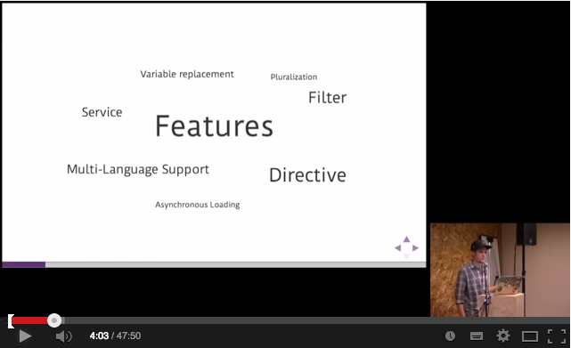
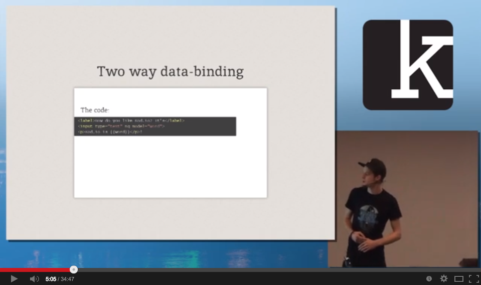

# 

> i18n for your Angular app, made easy!

### Status
| Branch        | Status         |
| ------------- |:-------------:|
| master        |  |
| canary        |     |
| BitDeli       |        |

### Presentation (Dutch AngularJS Meetup 2013)

### Presentation (Kod.io 2014)

### Links
* Website [http://angular-translate.github.io](http://angular-translate.github.io/)
* API Reference [http://angular-translate.github.io/docs/#/api](http://angular-translate.github.io/docs/#/api)
* Plato report [http://angular-translate.github.io/docs/plato](http://angular-translate.github.io/docs/plato)
* [Contribution Guidelines](https://github.com/angular-translate/angular-translate/blob/master/CONTRIBUTING.md)

### Useful resources
There are some very useful things on the web that might be interesting for you,
so make sure to check this list.

- [Tutorial on ng-newsletter.com](http://ng-newsletter.com/posts/angular-translate.html)
- [Examples and demos](https://github.com/angular-translate/angular-translate/wiki/Demos) - Currently on plnkr.co
- [Tutorial on angularjs.de](http://angularjs.de/artikel/angularjs-i18n-ng-translate) - German article
- [Tutorial on neoskop.de](http://www.neoskop.de/blog/angular-translate) - German article
- [angular-translate on GitHub](http://github.com/angular-translate/angular-translate) - The GitHub repository
- [angular-translate on ngmodules.org](http://ngmodules.org/modules/angular-translate)
- [angular-translate mailinglist](https://groups.google.com/forum/#!forum/angular-translate) - Discuss, ask et al!

### Thank you, community!
We got a lot of great feedback from the community so far! More and more people
use this module and they are always thankful for it and the awesome support they
get. I just want to make sure that you guys know: All this wouldn't have been
possible without these [great contributors](http://github.com/angular-translate/angular-translate/contributors)
and everybody who comes with new ideas and feature requests! So **THANK YOU**!
